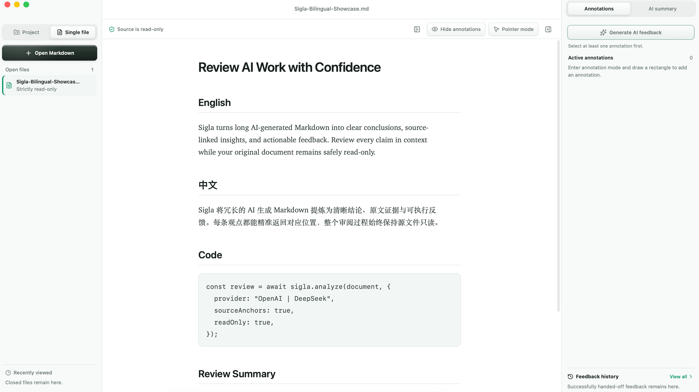
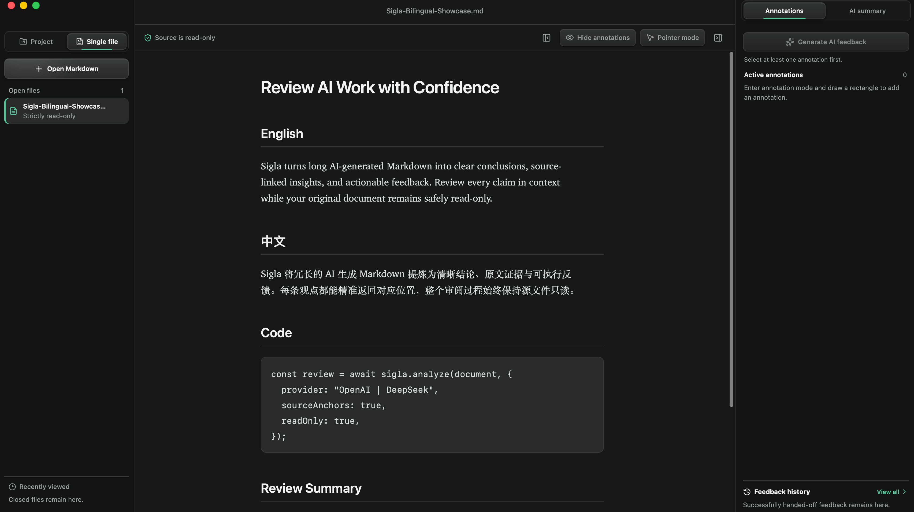
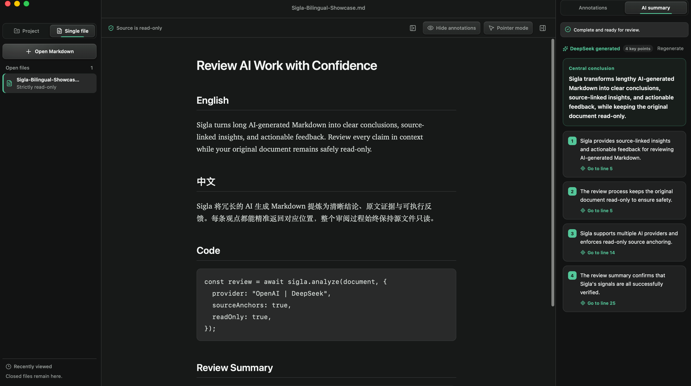
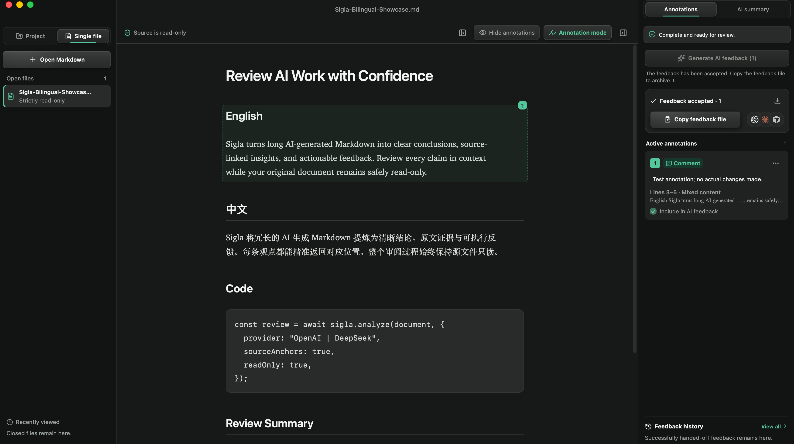

<div align="center">
  
  <h1>Sigla</h1>
  <p><strong>面向 AI 生成 Markdown 的人类审阅层。</strong></p>
  <p>把冗长、密集的 Agent 产出，转化为有原文证据的核心洞察、精准定位的批注，以及可直接交回 Agent 的修改任务；源文件始终只读。</p>
  <p>
    <a href="https://z18520736823-coder.github.io/sigla-desktop/zh/"><strong>产品主页</strong></a>
    ·
    <a href="https://github.com/z18520736823-coder/sigla-desktop/releases/tag/v1.0.0-preview.1"><strong>下载 macOS 版</strong></a>
    ·
    <a href="README.md">English</a>
  </p>
</div>

> **公开预览版 · macOS 11+ · Apple 芯片与 Intel**<br>
> 预览期间免费使用，源代码保持私有。

AI 正在生成越来越多的 Markdown，人的阅读时间却没有增加。Sigla 把这些内容转化为一套真正可审阅的结构：一个中心结论、少量关键方向、精准绑定原文的批注，以及可以直接交回 Codex 或其他 Agent 的修改任务。

## AI 生成了几十页，接下来怎么办？

- **长文本里，真正值得关注的是什么？**
- **一条反馈，能否精准回到对应的原文？**
- **一个观点发生变化，相关任务、约束与验收条件是否依然清晰？**
- **没有 API，甚至断网时，审阅还能否继续？**

## 四大支柱，一套完整审阅层

### 1. AI-powered Clarity｜AI 智能提炼

**由 OpenAI 或 DeepSeek 驱动，Sigla 将冗长的 Markdown 文档提炼为一个中心结论和 3–5 个关键要点。每条 AI 洞察都附带原文证据，一键即可返回对应位置。**

用户使用自己的 API Key，密钥由 macOS Keychain 保存。只有用户主动触发 AI 功能时，Sigla 才会向所选服务商发送完成任务所需的文档内容。

### 2. Effortless Annotation｜轻松框选批注

**内置便捷的框选标注。圈出任意段落，即可添加评论、问题或修改要求；每条批注都精准绑定原文，无需改动 Markdown 文件。**

批注保存在 Sigla 的本地私有数据库中。文档被外部工具修改后，Sigla 会重新核对锚点；匹配不确定时交由用户确认。

### 3. Agent-ready Feedback｜Agent 可执行反馈

**Sigla 将选中的批注整理成清晰的修改任务，包含准确位置、具体要求和验收标准，可直接交回 Codex 或其他 Agent 处理。相互关联或存在冲突的要求也会被明确列出。**

用户的原始表达与对应的原文证据会完整保留，让接手修改的 Agent 获得足够清晰的上下文。

### 4. Offline Continuity｜离线连续性

**无需 API 或网络连接，也能继续阅读、渲染、批注和生成本地基础反馈。联网 AI 只在用户主动触发时运行；源文件始终只读，应用状态保存在本机。**

Sigla 不提供修改、删除、移动、重命名或恢复源 Markdown 的操作。阅读状态、批注、AI 缓存和反馈历史都保存在应用私有空间。

## 看见 Sigla 的真实体验

### 安静、严格只读的审阅工作区



### 为双语 Markdown 优化的暗色阅读



### 每条 AI 洞察都能返回原文



### 可直接交给下一个 Agent 的批注反馈



## 从 Agent 产出到人类决策

```text
Agent 生产 → Sigla 提炼 → 人类审阅 → AI 整理反馈 → Agent 修改 → Sigla 验收
```

1. 从 Finder、Codex 或 Sigla 内部打开 Markdown。
2. 使用中英文字体优化、明暗主题、GFM、代码块、表格与 Mermaid 舒适阅读。
3. 在需要时调用 OpenAI 或 DeepSeek，生成带原文证据的阅读地图。
4. 框选具体段落，添加评论、问题或修改要求。
5. 将选中的批注整理成可执行反馈包。
6. 把反馈交回 Codex 或其他 Agent，并在 Sigla 中检查外部修改结果。

## 能力证明

| 领域 | Sigla 提供的能力 |
| --- | --- |
| 阅读 | 安全 GFM 渲染、中英文字体、代码、表格、Mermaid、章节折叠 |
| 审阅 | 框选批注、评论、问题、修改要求、原文锚点、批注重定位 |
| AI | OpenAI 与 DeepSeek BYOK、流式结果、原文证据、取消、缓存、本地降级 |
| Agent 工作流 | 结构化反馈包、Codex 返回、反馈历史、外部修改验收 |
| macOS | Finder 打开、可选默认 Markdown 阅读器、菜单栏驻留、系统/明亮/暗色主题 |
| 隐私 | 无账号、广告、行为分析、崩溃遥测和后台云同步 |

## 下载与安装

前往 [GitHub Releases](https://github.com/z18520736823-coder/sigla-desktop/releases/tag/v1.0.0-preview.1) 下载 **Sigla 1.0.0 公开预览版**。

- 架构：Universal 2，支持 Apple 芯片与 Intel
- 最低系统：macOS 11.0
- 分发格式：DMG
- 签名：ad-hoc，启用 hardened runtime
- Apple 公证：尚未完成
- 更新方式：手动下载

打开 DMG 后，将 Sigla 拖入“应用程序”。首次启动请前往 **Finder → 应用程序**，按住 Control 点击 Sigla 并选择“打开”。如 macOS 继续拦截，可前往 **系统设置 → 隐私与安全性** 允许本次打开。

下载校验值：

```text
SHA-256: eb47705320e80943b916e430e4dd3cc3b370c0caf56a8b53cbd132c0cd961ecc
```

完整步骤见[支持与安装说明](SUPPORT.md)。

## 隐私与 AI 边界

- 源 Markdown 始终通过严格只读流程打开。
- API Key 保存在 macOS Keychain，不进入 Sigla 数据库。
- 只有主动触发 AI 功能时，必要内容才会发送至 OpenAI 或 DeepSeek。
- Sigla 没有账号系统、遥测服务和文档同步服务器。
- 导出的反馈可能包含文档名、路径、原文、批注和 AI 建议，分享前请先检查。

详细内容见[隐私说明](legal/PRIVACY.zh-CN.md)、[最终用户许可协议](legal/EULA.zh-CN.md)和[安全政策](SECURITY.md)。

## 常见问题

### Sigla 开源吗？

当前没有开源。本仓库公开产品介绍、社区资料和安装包，Sigla 源代码继续采用专有软件许可并保持私有。

### Sigla 会修改 Markdown 吗？

Sigla 不提供修改、删除、移动、重命名或恢复源 Markdown 的操作。所有批注和审阅状态独立保存在应用本地私有数据库中。

### 没有 AI 可以使用吗？

可以。没有 API Key 或网络连接时，阅读、Markdown 渲染、批注、文件变化监听和本地基础反馈仍然可用。

### 支持哪些 AI 服务？

Sigla 1.0 预设支持 OpenAI 和 DeepSeek，采用用户自备 API Key 的方式。AI 功能可选，并且只在用户主动操作后运行。

### Sigla 会上传我的文档吗？

Sigla 没有文档同步服务器。用户主动生成 AI 总结或 AI 反馈时，完成任务所需的文档内容与审阅上下文会直接发送给用户选择的 AI 服务商。

## 加入社区

- [报告问题](https://github.com/z18520736823-coder/sigla-desktop/issues/new?template=bug.yml)
- [提出功能需求](https://github.com/z18520736823-coder/sigla-desktop/issues/new?template=feature.yml)
- [分享使用体验](https://github.com/z18520736823-coder/sigla-desktop/issues/new?template=experience.yml)
- [参与 Discussions](https://github.com/z18520736823-coder/sigla-desktop/discussions)

如果 Sigla 让 Agent 产出更容易理解和审阅，欢迎点亮 GitHub Star，帮助更多人发现它。

## 许可

Copyright © 2026 Mr.ZhouPeng. All rights reserved. Sigla 为专有软件，详见 [LICENSE](LICENSE) 与[最终用户许可协议](legal/EULA.zh-CN.md)。
